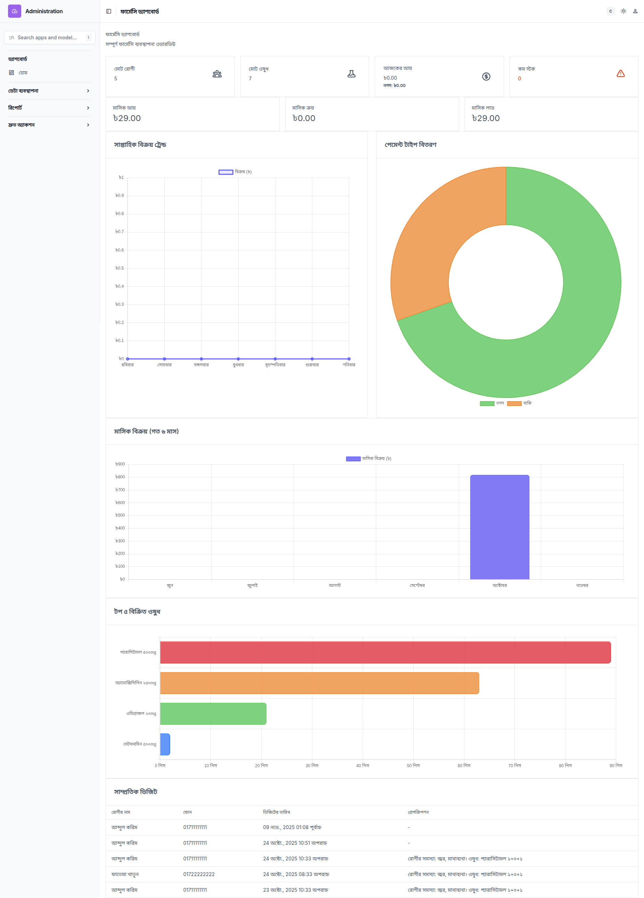

# 💊 ফার্মেসি ম্যানেজমেন্ট সিস্টেম

একটি আধুনিক এবং কার্যকর ফার্মেসি ব্যবস্থাপনা সিস্টেম Django এবং Unfold Admin দিয়ে তৈরি।

## ✨ বৈশিষ্ট্যসমূহ

### 🏥 রোগী ব্যবস্থাপনা
- রোগীর সম্পূর্ণ তথ্য সংরক্ষণ (নাম, ফোন, ঠিকানা)
- রোগীর ভিজিট হিস্ট্রি ট্র্যাকিং
- প্রেসক্রিপশন রেকর্ড ও ব্যবস্থাপনা
- **ইনলাইন সেলস**: ভিজিটের সাথে সরাসরি ওষুধ বিক্রয়

### 💊 ওষুধ ব্যবস্থাপনা
- ওষুধের সম্পূর্ণ তালিকা ও স্টক ব্যবস্থাপনা
- স্বয়ংক্রিয় স্টক আপডেট
- কম স্টকের জন্য সতর্কতা সিস্টেম
- ওষুধ ক্রয়ের বিস্তারিত রেকর্ড

### 💰 বিক্রয় ব্যবস্থাপনা
- রিয়েল-টাইম বিক্রয় ট্র্যাকিং
- নগদ ও বাকি পেমেন্ট অপশন
- স্বয়ংক্রিয় মূল্য গণনা
- বিক্রয়ের বিস্তারিত রিপোর্ট

### 📊 আধুনিক ড্যাশবোর্ড
- **ইন্টারঅ্যাক্টিভ চার্ট**: Bar, Pie, Doughnut, Line চার্ট
- **রিয়েল-টাইম ডেটা**: সব ডেটা ডাটাবেস থেকে সরাসরি
- **সাপ্তাহিক ট্রেন্ড**: গত ৭ দিনের বিক্রয় ট্রেন্ড
- **গ্লাস মরফিজম ডিজাইন**: আধুনিক UI/UX
- দৈনিক ও মাসিক আয়ের পরিসংখ্যান
- স্টক অবস্থার ভিজুয়াল প্রতিনিধিত্ব

## 🚀 ইনস্টলেশন

### 1. প্রয়োজনীয় প্যাকেজ ইনস্টল করুন:
```bash
pip install -r requirements.txt
```

### 2. ডাটাবেস সেটআপ:
```bash
python3 manage.py makemigrations
python3 manage.py migrate
```

### 3. সুপারইউজার তৈরি করুন:
```bash
python3 manage.py createsuperuser
```

### 4. নমুনা ডেটা তৈরি করুন (ঐচ্ছিক):
```bash
python3 create_sample_data.py
```

### 5. সার্ভার চালু করুন:
```bash
python3 manage.py runserver
```

## 🌐 অ্যাক্সেস URL সমূহ

- **কাস্টম ড্যাশবোর্ড**: http://127.0.0.1:8000/admin/pharmacy-dashboard/
- **অ্যাডমিন প্যানেল**: http://127.0.0.1:8000/admin/
- **স্ট্যান্ডঅ্যালোন ড্যাশবোর্ড**: http://127.0.0.1:8000/dashboard/

## 📱 ব্যবহারের নির্দেশনা

### 🎯 প্রথম সেটআপ
1. Admin প্যানেলে লগইন করুন
2. **ওষুধ যোগ করুন**: Medicine সেকশনে গিয়ে ওষুধের তালিকা তৈরি করুন
3. **রোগী যোগ করুন**: Patient সেকশনে রোগীর তথ্য যোগ করুন
4. **ক্রয় রেকর্ড করুন**: Purchase সেকশনে ওষুধ কেনার হিসাব রাখুন

### 🏥 দৈনিক কাজের প্রবাহ
1. **নতুন ভিজিট তৈরি**: Visit সেকশনে গিয়ে রোগীর ভিজিট তৈরি করুন
2. **ইনলাইন সেলস**: একই পেজে ওষুধ বিক্রয়ের তথ্য যোগ করুন
3. **স্বয়ংক্রিয় গণনা**: ওষুধ নির্বাচন করলে দাম অটো-ফিল হবে
4. **পেমেন্ট টাইপ**: নগদ বা বাকি নির্বাচন করুন

### 📊 ড্যাশবোর্ড ফিচার
- **আজকের পরিসংখ্যান**: আয়, রোগী সংখ্যা, স্টক অবস্থা
- **চার্ট ভিউ**: ইন্টারঅ্যাক্টিভ চার্টে ডেটা দেখুন
- **সাপ্তাহিক ট্রেন্ড**: গত ৭ দিনের বিক্রয় প্যাটার্ন
- **দ্রুত অ্যাকশন**: সরাসরি লিংক দিয়ে কাজ করুন

## 🔧 প্রযুক্তিগত বৈশিষ্ট্য

### Backend
- **Django 4.2.7**: শক্তিশালী ওয়েব ফ্রেমওয়ার্ক
- **Unfold Admin**: আধুনিক অ্যাডমিন ইন্টারফেস
- **SQLite**: ডাটাবেস (প্রোডাকশনে PostgreSQL/MySQL ব্যবহার করুন)

### Frontend
- **Chart.js**: ইন্টারঅ্যাক্টিভ চার্ট
- **CSS3**: গ্লাস মরফিজম ও গ্রেডিয়েন্ট ইফেক্ট
- **Responsive Design**: সব ডিভাইসে কাজ করে
- **AJAX**: রিয়েল-টাইম ডেটা আপডেট

### বিশেষ ফিচার
- **ইনলাইন এডিটিং**: ভিজিটের সাথে সেলস
- **অটো-ক্যালকুলেশন**: স্বয়ংক্রিয় মূল্য গণনা
- **স্টক ম্যানেজমেন্ট**: অটোমেটিক স্টক আপডেট
- **বাংলা ইন্টারফেস**: সম্পূর্ণ বাংলায়

## 👤 ডিফল্ট লগইন
- **Username**: admin
- **Password**: admin (প্রথমবার সেটআপের সময় পরিবর্তন করুন)

## 📈 নমুনা ডেটা
সিস্টেমে নমুনা ডেটা রয়েছে:
- ৫টি রোগী
- ৮টি ওষুধ (৩টি কম স্টক সহ)
- ৫টি ক্রয় রেকর্ড
- ১৭টি ভিজিট
- ৩০টি বিক্রয় রেকর্ড

## 🎨 ড্যাশবোর্ড প্রিভিউ



### ড্যাশবোর্ড ফিচার:
- **গ্রেডিয়েন্ট কার্ড**: বিভিন্ন রঙের আকর্ষণীয় কার্ড
- **হোভার ইফেক্ট**: ইন্টারঅ্যাক্টিভ অ্যানিমেশন
- **চার্ট ভিজুয়ালাইজেশন**: ৪ ধরনের চার্ট
  - 📈 সাপ্তাহিক বিক্রয় ট্রেন্ড (Line Chart)
  - 🥧 পেমেন্ট টাইপ বিতরণ (Doughnut Chart)
  - 📊 মাসিক বিক্রয় (Bar Chart)
  - 🏆 টপ ৫ বিক্রিত ওষুধ (Horizontal Bar Chart)
- **রেসপন্সিভ লেআউট**: মোবাইল ও ডেস্কটপ ফ্রেন্ডলি
- **রিয়েল-টাইম ডেটা**: সব চার্ট ডাটাবেস থেকে লাইভ ডেটা দেখায়

সিস্টেমটি সম্পূর্ণ বাংলায় এবং ব্যবহার করা অত্যন্ত সহজ! 🚀